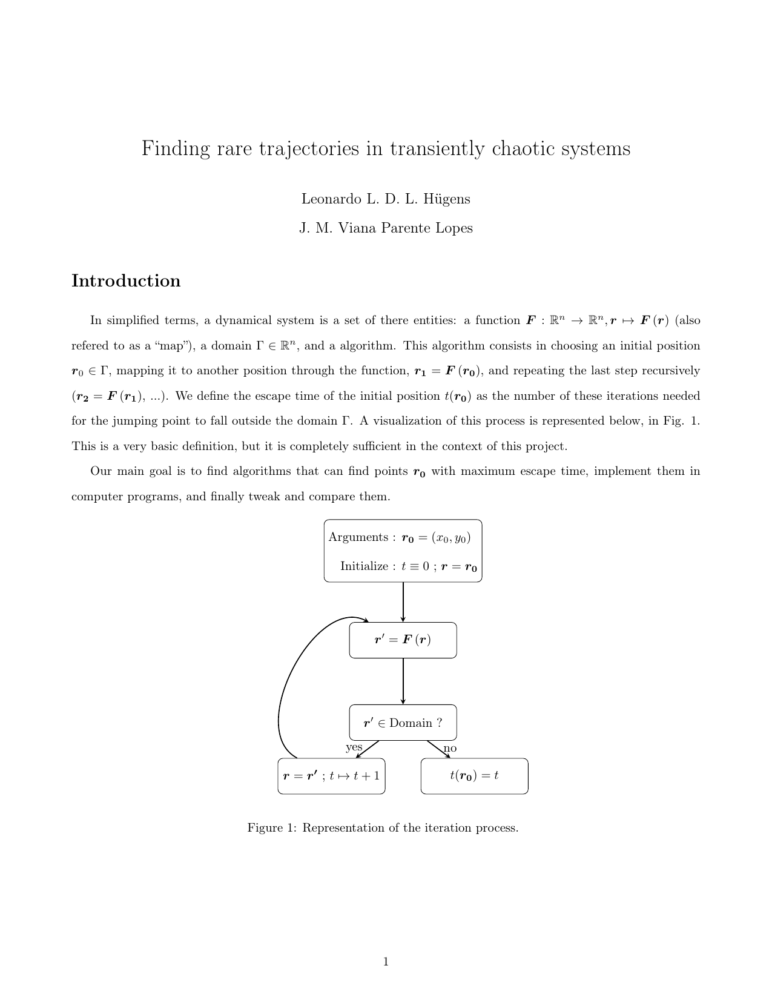
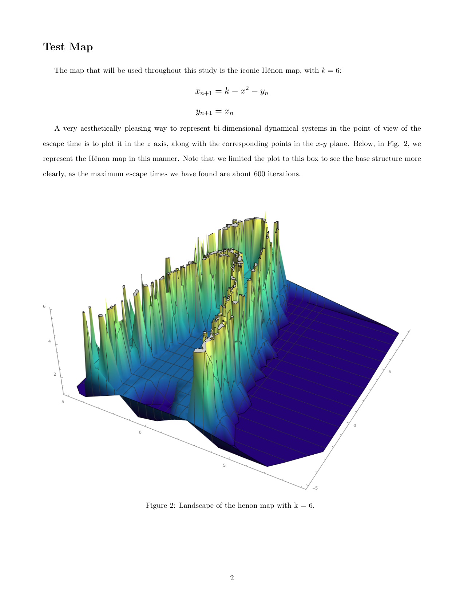
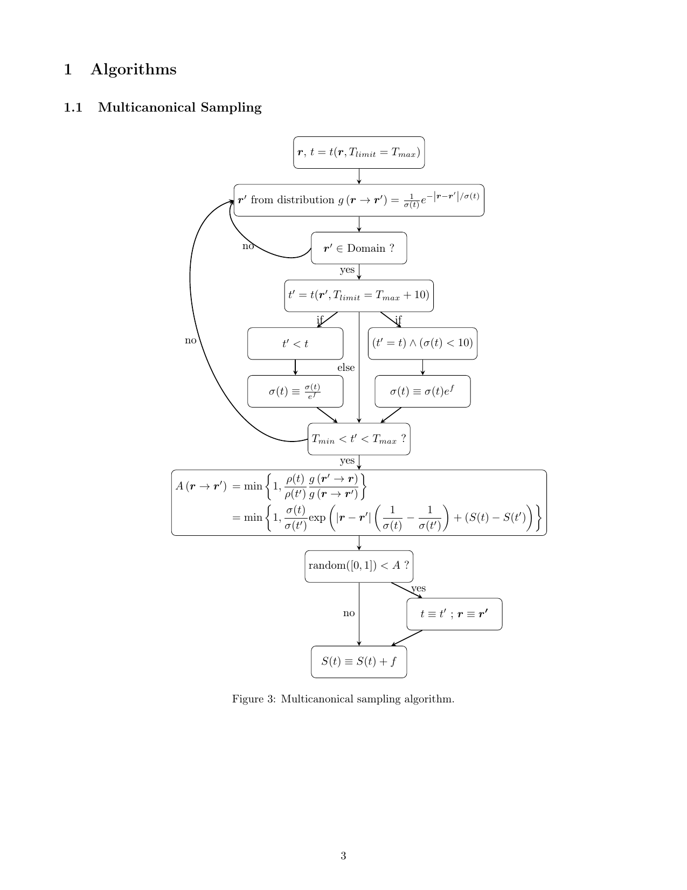
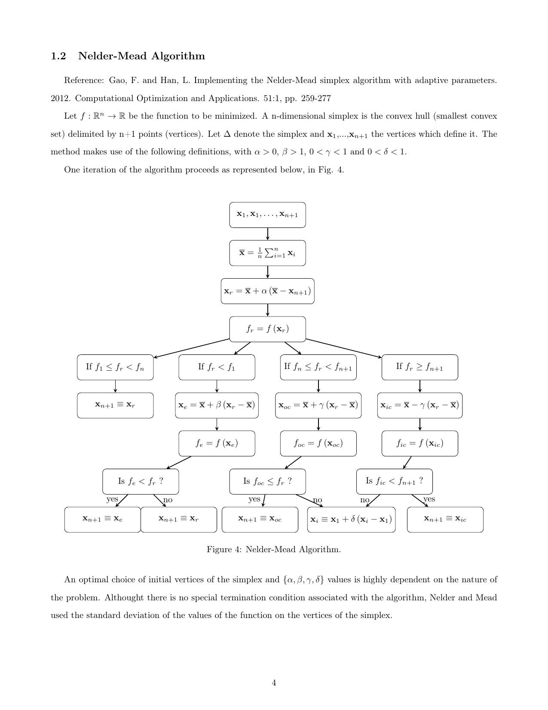
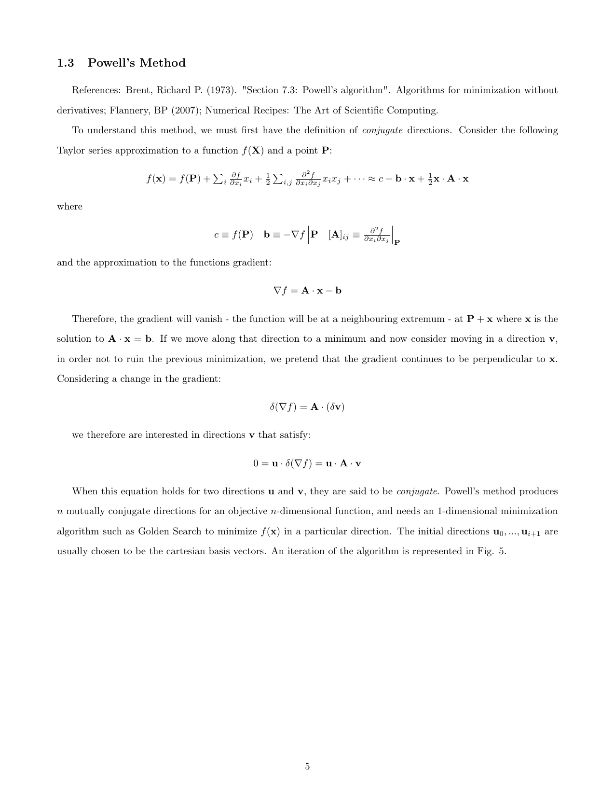
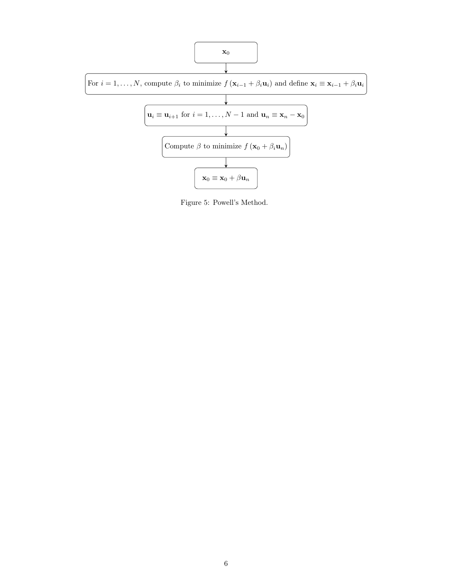
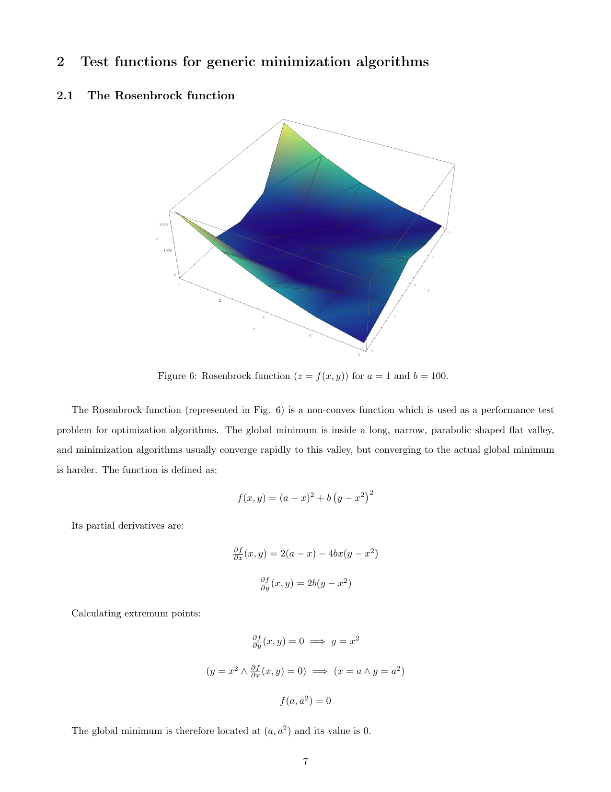

<h1 align="center">Finding rare trajectories in transiently chaotic systems</h1>

## About

In simplified terms, a dynamical system is a set of there entities: a function (also refered to as a “map”), a domain, and the following algorithm: choose an initial position, map it to another position through the function,
   and repeating the last step recursively. We define the escape time of the initial position as the number of these iterations needed for the jumping point to fall outside the chosen domain.
This is a very basic definition, but it is completely sufficient in the context of this project.
Our main goal is to find algorithms that can find points \boldsymbol{r_{0}} with maximum escape time, implement them in computer programs, and finally tweak and compare them.
## How to run the code

### Usage commands

```sh
make            # compile and run
make compile    # only compile
make run        # only run
```

### mpreal

The mpreal.h and mpreal0.h files are wrappers which make the use of GNU MPFR (GNU Multiple Precision Floating-Point Reliably) much easier. All the proper credits are contained in the files themselves. If the compiler outputs "deprecated" warnings, just switch the names of the mpreal files, that should fix it:

```sh
mv mpreal.h temp.h && mv mpreal0.h mpreal.h && mv temp.h mpreal0.h
```

If you lose track of which one is which, the most up-to-date version has a "modified version" flag in the beginning of the file itself.

## Notes

<p align="center">
    
    
    
    
    
    
    
</p>
