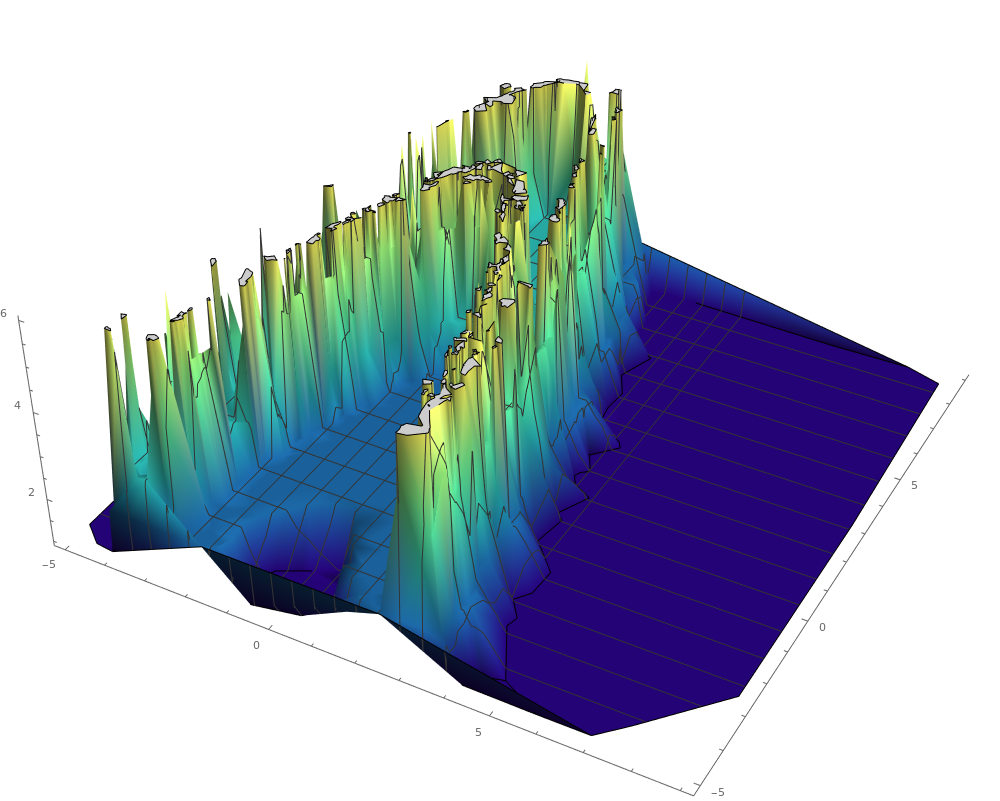
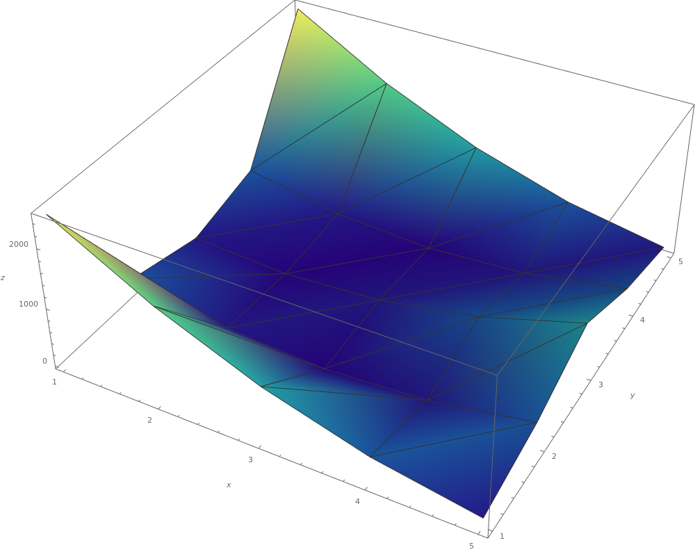

---
author:
- |
  Leonardo L. D. L. Hügens\
  J. M. Viana Parente Lopes\
  Eduardo G. Altmann
title: Finding rare trajectories in transiently chaotic systems
---

Introduction {#introduction .unnumbered}
============

Given a specific dynamical system, with an associated map $\boldsymbol{r}_{n+1}=\boldsymbol{F}\left(\boldsymbol{r}_{n}\right)$, it is possible to define an escape time $t(\boldsymbol{r})$ as the number of the map iterations necessary for the trajectory to leave a certain domain $\Gamma$. The main goal of this study is to perform a comparative analysis between computer algorithms specificaly designed for an efficient search of long trajectories and generic maximization algorithms.

Map Parameters {#map-parameters .unnumbered}
==============

For this study, we used the iconic Hénon Map with $k=6$:

$x_{n+1}=k-x_{n}{{}^2}-y_{n}$

$y_{n+1}=x_{n}$

The associated Jacobian matrix is $\mathbf{{J(\mathbf{x})}}=\left(\begin{array}{cc}
-2x_{n} & -1\\
1 & 0
\end{array}\right)$, and the respective determinant is $J(\mathbf{x})=1$. Its eigenvalues and eigenvectors are respectively $e_{\pm}=-x\pm\sqrt{x{{}^2}-1}$ and $\mathbf{e_{\pm}}=(e_{\pm},1)$.

The Lyapunov exponent is, therefore:

$\lambda_{n}(\boldsymbol{x})=\frac{1}{n}\sum_{i=0}^{t-1}log(J(\mathbf{x}))=0$

The largest escape time generated yet by a multicanonical simulation on $\Gamma=[-5,9]{{}^2}$ algorithm is 627 map iterations.

The landscape obtained is represented below:

Generic Maximization Algorithms {#generic-maximization-algorithms .unnumbered}
===============================

The source <https://docs.scipy.org/doc/scipy/reference/tutorial/optimize.html> provides several generic minimization algorithms implemented in the scipy.optimize package, ready to use.

The following algorithms are automatically unusable due to the need of a gradient of the function to be minimized, which is generaly impossible to obtain due to the roughness of the landscape: Newton-Conjugate-Gradient (NCG), Trust-Region NCG, Trust-Region Truncated Generalized Lanczos / NCG, Trust-Region Nearly Exact.

At first sight, the usable algorithms are those who only rely on the evaluation of the function, those which belong to the **Pattern Search** family (also known as direct search, derivative search, or black-box search).

Multicanonical Sampling
-----------------------

Nelder-Mead Algorithm
---------------------

Reference: Gao, F. and Han, L. Implementing the Nelder-Mead simplex algorithm with adaptive parameters. 2012. Computational Optimization and Applications. 51:1, pp. 259-277

Let $f:\mathbb{R}^{n}\rightarrow\mathbb{R}$ be the function to be minimized. A n-dimensional simplex is the convex hull (smallest convex set) delimited by n+1 points (vertices). Let $\Delta$ denote the simplex and $\mathbf{x}_{1}$,\...,$\mathbf{x}_{n+1}$ the vertices which define it. The method makes use of the following definitions, with $\alpha>0$, $\beta>1$, $0<\gamma<1$ and $0<\delta<1$.

One iteration of the algorithm proceeds as follows:\

\

An optimal choice of initial vertices of the simplex and $\{\alpha,\beta,\gamma,\delta\}$ values is highly dependent on the nature of the problem. Althought there is no special termination condition associated with the algorithm, Nelder and Mead used the standard deviation of the values of the function on the vertices of the simplex.

Powell's Method
---------------

References: Brent, Richard P. (1973). Section 7.3: Powell's algorithm. Algorithms for minimization without derivatives; Flannery, BP (2007); Numerical Recipes: The Art of Scientific Computing.

To understand this method, we must first have the definition of *conjugate* directions. Consider the following Taylor series approximation to a function $f(\mathbf{X})$ and a point $\mathbf{P}$:

$f(\mathbf{x})=f(\mathbf{P})+\sum_{i}\frac{\partial f}{\partial x_{i}}x_{i}+\frac{1}{2}\sum_{i,j}\frac{\partial^{2}f}{\partial x_{i}\partial x_{j}}x_{i}x_{j}+\cdots\approx c-\mathbf{b}\cdot\mathbf{x}+\frac{1}{2}\mathbf{x}\cdot\mathbf{A}\cdot\mathbf{x}$

where

$c\equiv f(\mathbf{P})\quad\mathbf{b}\equiv-\nabla f\left|\mathbf{P}\quad[\mathbf{A}]_{ij}\equiv\frac{\partial^{2}f}{\partial x_{i}\partial x_{j}}\right|_{\mathbf{P}}$

and the approximation to the functions gradient:

$\nabla f=\mathbf{A}\cdot\mathbf{x}-\mathbf{b}$

Therefore, the gradient will vanish - the function will be at a neighbouring extremum - at $\mathbf{P+x}$ where $\mathbf{x}$ is the solution to $\mathbf{A}\cdot\mathbf{x}=\mathbf{b}$. If we move along that direction to a minimum and now consider moving in a direction $\mathbf{v}$, in order not to ruin the previous minimization, we pretend that the gradient continues to be perpendicular to $\mathbf{x}$. Considering a change in the gradient:

$\delta(\nabla f)=\mathbf{A}\cdot(\delta\mathbf{v})$

we therefore are interested in directions $\mathbf{v}$ that satisfy:

$0=\mathbf{u}\cdot\delta(\nabla f)=\mathbf{u}\cdot\mathbf{A}\cdot\mathbf{v}$

When this equation holds for two directions $\mathbf{u}$ and $\mathbf{v}$, they are said to be *conjugate*. Powell's method produces $n$ mutually conjugate directions for an objective $n$-dimensional function, and needs an 1-dimensional minimization algorithm such as Golden Search to minimize $f(\mathbf{x})$ in a particular direction. The initial directions $\mathbf{u}_{0},...,\mathbf{u}_{i+1}$ are usually chosen to be the cartesian basis vectors. An iteration of the algorithm is represented below.

The Rosenbrock function
=======================

The Rosenbrock function (represented in the figure above) is a non-convex function which is used as a performance test problem for optimization algorithms. The global minimum is inside a long, narrow, parabolic shaped flat valley, and minimization algorithms usually converge rapidly to this valley, but converging to the actual global minimum is harder. The function is defined as:

$f(x,y)=(a-x)^{2}+b\left(y-x^{2}\right)^{2}$

Its partial derivatives are:

$\frac{\partial f}{\partial x}(x,y)=2(a-x)-4bx(y-x^{2})$

$\frac{\partial f}{\partial y}(x,y)=2b(y-x^{2})$

Calculating extremum points:

$\frac{\partial f}{\partial y}(x,y)=0\implies y=x^{2}$

$(y=x^{2}\land\frac{\partial f}{\partial x}(x,y)=0)\implies(x=a\land y=a^{2})$

$f(a,a^{2})=0$

The global minimum is therefore located at $(a,a^{2})$ and its value is $0$.
